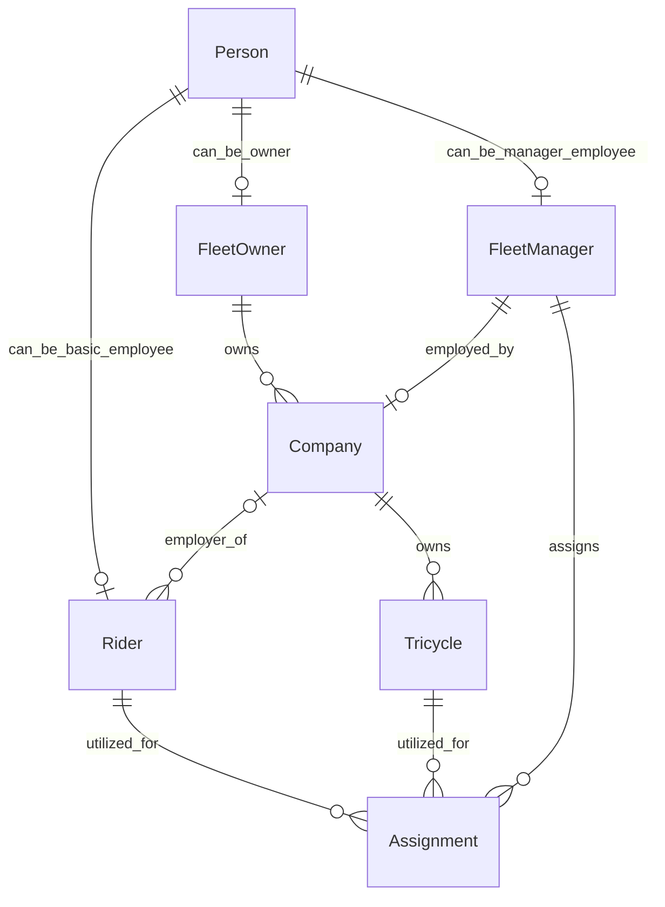
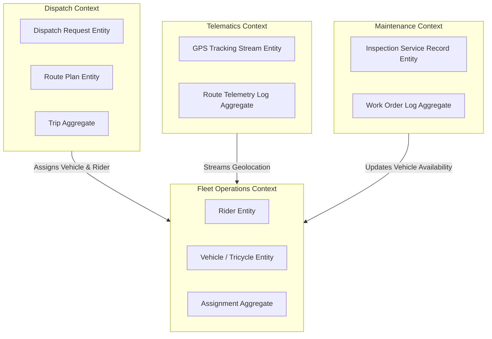
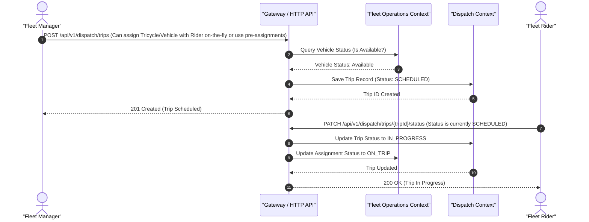

# Fleet Management Ontology

An ontology map showing the properties and relationships between companies, tricycles, riders, fleet owners and fleet managers in a fleet management system.

It is a set of YAML files each file describing one entity or one enum, and together they define the shape of the domain.

## What is an ontology?

An ontology is a written-down description of **what exists in a domain and how those things relate to each other**. It answers questions like _what is a rider?_, _can the same person be both an owner and a rider?_, and _how does a tricycle end up with a rider?_ It does this in a form precise enough for a machine to read, and plain enough for a person to read too.

It is not a database schema. A schema is about storage: tables, columns, indexes. An ontology is about **meaning**: it describes the domain itself, independent of where the data eventually lives. From these files you could build a Postgres database, a REST API, or a set of TypeScript types, and all three would agree with each other because they came from the same description.

That is the point of writing one: the rules of the business live in a single place that everyone (engineers, product, and future you) can read, instead of being scattered across code, migrations and people's heads.

### The building blocks

| Term             | What it means                                        | Example here                                                     |
| ---------------- | ---------------------------------------------------- | -----------------------------------------------------------------|
| **Entity**       | A kind of thing that exists in the domain            | `Rider`, `Tricycle`, `Company`                                   |
| **Property**     | A fact stored on the entity itself                   | `Tricycle.license_plate_number` is a _string_                    |
| **Relationship** | A link from one entity to another                    | `Tricycle.property_of` points at a `Company`                     |
| **Cardinality**  | How many things are allowed at the far end of a link | `one`, `zero..one`, `many`                                       |
| **Enum**         | A fixed list of allowed values for a property        | `TricycleCondition`: _operable_, _needs_repair_, _fully_damaged_ |

### Reading cardinality

Cardinality is worth reading closely, because most of the model's rules live there:

- **`one`**: exactly one, and it is required. `Tricycle.property_of → Company (one)` means every tricycle belongs to a company. There is no such thing as an unowned tricycle here.
- **`zero..one`**: at most one, and it is optional. `Rider.works_for → Company (zero..one)` means a rider may currently be between jobs.
- **`many`**: any number, including none. `Company.owns → Tricycle (many)`.

### Relationships are written from both sides

Most links appear twice, once on each entity. `Company.owns → Tricycle (many)` and `Tricycle.property_of → Company (one)` are the same link seen from opposite ends. Reading both gives you the full rule: **a company has many tricycles, and each tricycle belongs to exactly one company.**

The sections below list each entity's properties and the relationships that start from it.

## Layout

```
ontology.yml        the manifest: lists every entity and enum
entities/           one file per entity
enum/               one file per enum
```

## The core idea behind this ontology

A **Person** is just a human being and their contact details. Being a _rider_, a _fleet owner_, or a _fleet manager_ is a separate thing a person can be.

A person could be any of those, several of them, or none. So `Rider`, `FleetOwner` and `FleetManager` are their own entities, each pointing back at the person they are (`is`), and each carrying its own status. This is why one person can own a company and also ride for another, without either role interfering with the other.

The **Company** is what ties the operation together. A fleet owner does not own tricycles directly. They own companies, and the company holds the fleet and the riders. A fleet manager runs the company day to day and is the one who assigns tricycles to riders.

```
FleetOwner ──owns──▶ Company ──owns────▶ Tricycle
                        |   \──employer_of──▶ Rider
                        │
                   employer_of
                        │
                        ▲ 
                   FleetManager ──assigns──▶ Assignment
```

## Entities

### Person

A person's information. A person could be a rider and/or fleet owner and/or fleet manager.

| Property     | Type   |        |
| ------------ | ------ | ------ |
| id           | uuid   | unique |
| first_name   | string |        |
| last_name    | string |        |
| email        | string | unique |
| phone_number | string |        |
| address      | string |        |

- `can_be_basic_employee` → **Rider** (zero..one) `in_service_of` → **Company** (zero..one)
- `can_be_owner` → **FleetOwner** (zero..one) `in_service_of` → **Company** (many)
- `can_be_manager_employee` → **FleetManager** (zero..one) `in_service_of` → **Company** (zero..one)

### FleetOwner

The owner of one or more fleet companies.

| Property | Type             |        |
| -------- | ---------------- | ------ |
| id       | uuid             | unique |
| status   | FleetOwnerStatus |        |

- `is` → **Person** (one)
- `owns` → **Company** (many)

A fleet owner reaches tricycles and riders only through the companies they own.

### FleetManager

Manages the fleet and riders of a company on behalf of the fleet owner.

| Property | Type               |        |
| -------- | ------------------ | ------ |
| id       | uuid               | unique |
| status   | FleetManagerStatus |        |

- `is` → **Person** (one)
- `works_for` → **Company** (zero..one)
- `assigns` → **Assignment** (many) `in_service_of` → **Company** (one)
- `manages` → **Tricycle** (many) `in_service_of` → **Company** (one)
- `manages` → **Rider** (many) `in_service_of` → **Company** (one)

### Company

A business that manages tricycle fleets, owned by the fleet owner and managed by a fleet manager on behalf of the fleet owner.

| Property | Type          |        |
| -------- | ------------- | ------ |
| id       | uuid          | unique |
| name     | string        |        |
| status   | CompanyStatus |        |

- `property_of` → **FleetOwner** (one)
- `employer_of` → **FleetManager** (zero..one) `in_service_of` → #self
- `owns` → **Tricycle** (many)
- `employer_of` → **Rider** (many) 
- `utilizes_process` → **Assignment** (many) `in_service_of` → #self

### Rider

A rider is a person that is employed by a fleet company. A rider can be employed by just one company and is assigned to a tricycle for a period.

| Property | Type        |        |
| -------- | ----------- | ------ |
| id       | uuid        | unique |
| status   | RiderStatus |        |

- `is` → **Person** (one)
- `operates` → **Tricycle** (one) `in_service_of` → **Assignment** (one)
- `works_for` → **Company** (zero..one)
- `utilized_for` → **Assignment** (many) `in_service_of` → **Company** (one)
- `managed_by` → **FleetManager** (one) `in_service_of` → **Company** (one)

### Tricycle

A tricycle belongs to a company's fleet and is assigned to riders over time.

| Property                        | Type                |                                         |
| ------------------------------- | ------------------- | --------------------------------------- |
| id                              | uuid                | unique                                  |
| license_plate_number            | string              | unique                                  |
| vehicle_identificationn_number  | string              | unique                                  |
| capacity_kg                     | double              | what is the load capacity               |
| status                          | TricycleStatus      | what is the service state               |
| condition                       | TricycleCondition   | what is the mechanical health           |
| fuel_type                       | TricycleEnergySource| what energy source does it use for power|

The **status** and **condition** are separate on purpose, because a tricycle can be in concurrent states. 
For example, a tricycle can be `in_service` and `needs_repair` at the same time. A tricycle can also
be in `impounded` and `fully_damaged` OR `idle` and `operable` at the same time. Yet, a tricycle cannot be `in_service` and `fully_damaged`.

A combination of the **status** and the **condition** (as concurrent states) determine the availability of a tricycle (vehicle)

- `property_of` → **Company** (one)
- `operated_by` → **Rider** (one) `in_service_of` → **Assignment** (one)
- `utilized_for` → **Assignment** (many) `in_service_of` → **Company** (one)
- `managed_by` → **FleetManager** (one) `in_service_of` → **Company** (one)

### Assignment

Assignment links a company's tricycle to one of its riders at a point in time. A rider can only be assigned to one tricycle at a time. An assignment is `assinged_by` the fleet manager of the fleet owner. It is meant to serve as audit data in the future.

| Property   | Type     |                                             |
| ---------- | -------- | ------------------------------------------- |
| id         | uuid     | unique                                      |
| started_at | datetime | `not null`                                  |
| ended_at   | datetime | `null` means the assignment is still active |

- `utilizes` → **Rider** (one) `in_service_of` → **Company** (one)
- `property_of` → **Company** (one)
- `utilizes` → **Tricycle** (one) `in_service_of` → **Company** (one)
- `assigned_by` → **FleetManager** (one) `in_service_of` → **Company** (one)

Because a rider and a tricycle each have **many** assignments, this entity is what gives the model history: you can see who rode which tricycle, when, and who assigned it.

## Enums

| Enum                 | Values                                |
| -------------------- | ------------------------------------- |
| RiderStatus          | active, inactive, suspended           |
| FleetOwnerStatus     | active, inactive, suspended           |
| FleetManagerStatus   | active, inactive, suspended           |
| CompanyStatus        | active, shutdown                      |
| TricycleStatus       | in_service, idle, impounded, retired  |
| TricycleCondition    | operable, needs_repair, fully_damaged |
| TricycleEnergySource | petrol, diesel, electric              |

## The relationship map



## The context map



## Context Mapping & Strategic Bounded Contexts

>The domain model is broken up into distinct modules (or vertical slices) based on:

1. **Data**: Data schema (or database table) definitions tied directly to specific workflows/use cases.

2. **Interaction**: API endpoint boundaries aligned with actors and allowed (i.e. access-controlled) operations.

3. **Context**: Isolation of related entity concepts operating under distinct business rules for different actors.

## Core Entities, Actions, Actors & Workflows

>Primary Domain Actors (for RBAC, ABAC, ReBAC)

- Fleet Manager (`ACTOR_MANAGER`): Manages trip schedules, routes, vehicle assignments, and real-time trip monitoring.

- Rider (`ACTOR_RIDER`): Executes assigned trips, submits vehicle inspection logs, and updates live location/status.

- Maintenance Technician (`ACTOR_TECHNICIAN`): Conducts inspections, executes work orders, logs maintenance costs, and manages vehicle service status.

- Fleet Owner (`ACTOR_ADMIN`): Oversees fleet registration, user role access control, driver licensing records, and overall fleet system configurations.




## Processing Ontology files

Ontology files will be processed in such a way that ensures that duplicate keys that define relationships are never overwritten but are properly detected and preserved.

```
YAML
 │
 ▼
Raw Ontology
 │
 ▼
Duplicate-key Preservation
 │
 ▼
Relationship Reconciliation
 │
 ├── Rider -- works_for --> Company
 │       ↕
 │   Company -- employer_of --> Rider
 │
 ├── FleetOwner -- owns --> Company
 │       ↕
 │   Company -- property_of --> FleetOwner
 │
 └── Assignment -- utilizes --> Rider
         +
     Assignment -- utilizes --> Tricycle
 │
 ▼
Canonical Ontology Graph with Context Map & Sequences (Mermaid) + Activities (UML)
 │
 ├──────────────┬───────────────┐
 ▼              ▼               ▼
OpenAPI     JSON Model      SQLite / MySQL / PostgreSQL schemas
 │
 ▼
TypeScript Types
```

Therefore, the duplicate key for the `Assignment` and `Rider` relationship in the ontology now becomes:

>openapi.yaml
```yaml
properties:
  utilizes_rider:
    $ref: '#/components/schemas/Rider'

  utilizes_tricycle:
    $ref: '#/components/schemas/Tricycle'
```

And the duplicate key for the `Company` and `FleetManager` relationship in the ontology now becomes:

>openapi.yaml
```yaml
properties:
  employer_of_fleet_manager:
    $ref: '#/components/schemas/FleetManager'

  employer_of_rider:
    type: array
    items:
      $ref: '#/components/schemas/Rider'
```
